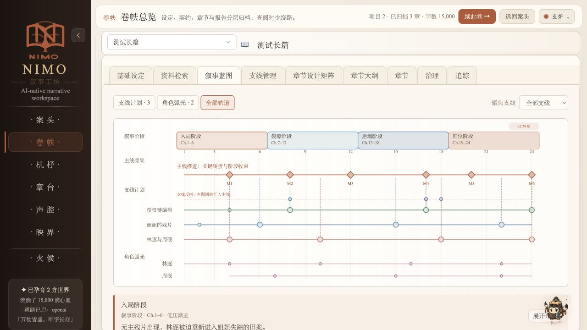
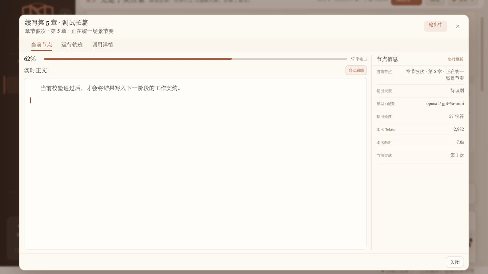
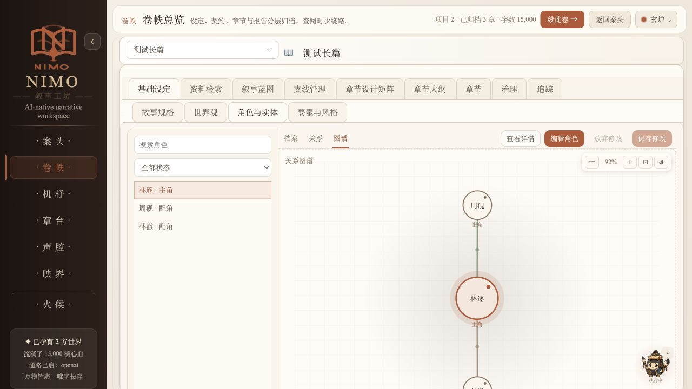
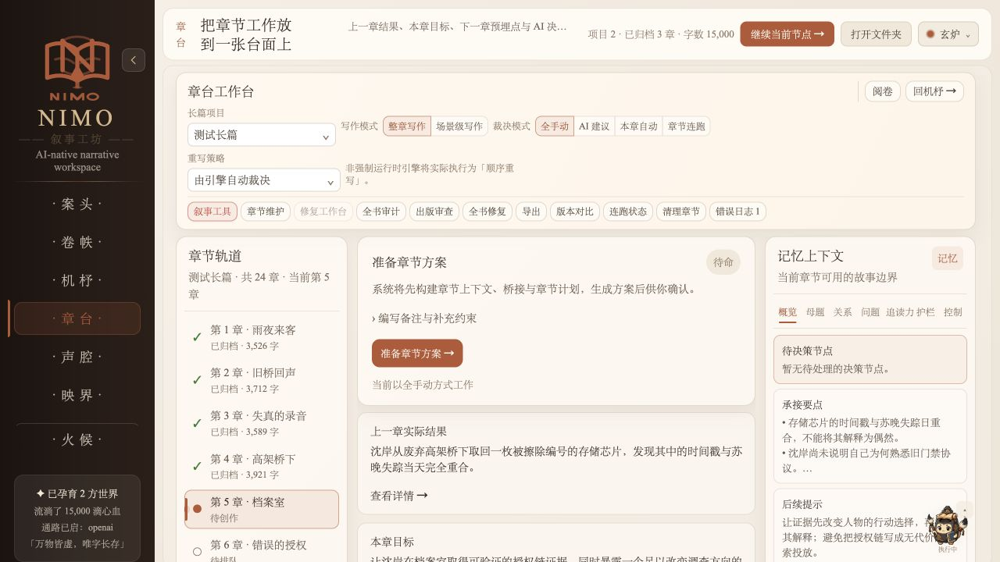
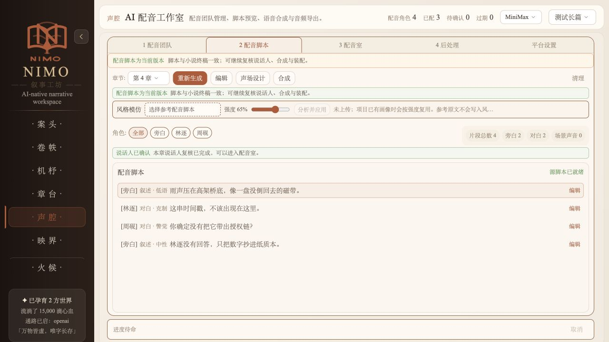
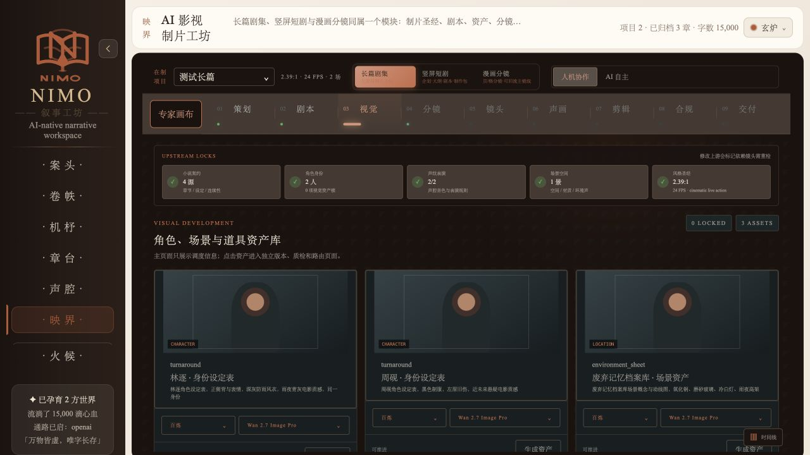
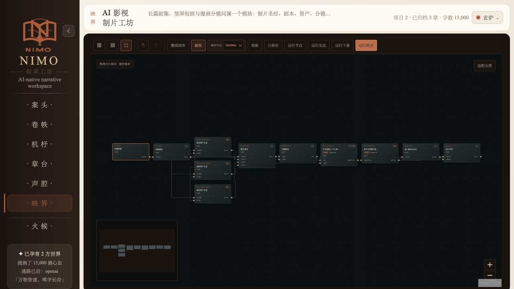

<div align="center">
  
  <h1>NIMO · Novel Forge</h1>
  <p><strong>让脑海里的故事，一章一章落到纸上。</strong></p>
  <p>作者主导的开源 AI 小说创作工作台</p>
  <p>✍️ 写故事 · 🧭 理大纲 · 🔎 做审阅 · 🎙️ 听角色</p>
</div>

**[MIT 开源](LICENSE)** · Python 3.11+ · React / Tauri · [构建与测试](.github/workflows/ci.yml)

**[开始使用](#从源码开始)** · [使用手册](MANUAL.md) · [文档导航](docs/README.md) · [参与贡献](CONTRIBUTING.md) · [开源声明](#开源与致谢)

一个人物、一条悬念，或者一句还没想好结尾的对白，都可以成为故事的起点。NIMO 把设定、大纲、章节、审阅与配音放进同一工作台，陪你把灵感整理成能够继续写下去的作品。

**故事由你决定，AI 参与构思与执行。** 从短篇到长篇连载，你可以选择模型、设定创作范围，查看候选修改，并保留对正文的最终判断。

> **开源说明** · 项目自有代码采用 [MIT License](LICENSE)，支持从源码运行、学习和修改。当前版本 **0.1.0**，持续开发中；模型服务和权重需自行配置，第三方组件保留各自许可。

## 👀 一张写作桌，几处好去处

**卷帙 · 看清故事如何展开** — 叙事阶段、主线转折、支线与角色弧光，在同一张蓝图里对齐。



| 去哪里 | 做什么 |
| :--- | :--- |
| **案头** | 总览作品与进度，查看任务节点、运行轨迹和调用详情 |
| **卷帙** | 查阅设定与章节，梳理人物关系、叙事蓝图和章节设计 |
| **机杼** | 从短篇创意或长篇立项开始，配置任务并跟进执行 |
| **章台** | 对照章节轨道、当前目标与记忆上下文，继续写作和审阅 |
| **声腔** | 管理配音团队与脚本，选择音色并准备语音制作 |
| **映界** | 从剧本、视觉资产到分镜与交付；专家画布串联制作节点 |

<details>
<summary>📚 案头与卷帙：作品、任务和人物图谱</summary>

**案头 · 今天从哪一卷继续**


**任务详情 · 看见当前步骤和运行证据**



**人物图谱 · 理清角色之间的牵连**



</details>

<details>
<summary>✍️ 机杼与章台：从立项到逐章创作</summary>




</details>

<details>
<summary>🎙️ 声腔：让文字有自己的声音</summary>



</details>

<details>
<summary>🎬 映界：视觉资产与自由节点画布</summary>



阶段栏旁的 **专家画布** 可直接打开节点工作流；支持缩放、节点检查和专注模式。长篇剧集、竖屏短剧与漫画分镜属于同一映界模块。



</details>

<sub>2026-09-07 从当前 React 前端实拍，采用离线合成数据；同一前端用于 Tauri 桌面。不是旧 PySide 界面，也不代表真实模型生成效果或原生打包验收。[截图来源与核验范围](docs/images/nimo/README.md)。</sub>

## 📖 从一个念头，到下一章

> **虚构创意示例**：一家只在雨夜营业的修表铺，收到一只走向明天的怀表。
>
> 谁送来了它？掌柜为什么不肯修？当指针停下，谁将失去明天？

你可以从这样的念头开始，在工作台里逐步补齐人物、规则和情节。这段文字仅用于说明创作场景，不是用户作品或模型生成效果展示。

| ① 搭起故事 | ② 展开章节 | ③ 审阅与打磨 | ④ 继续创作 |
| :--- | :--- | :--- | :--- |
| 整理世界观、人物与大纲 | 确认方案，生成和编辑草稿 | 查看问题、比较候选、验收正文 | 归档后推进下一章，或进入配音工作流 |

在 **AI 共创模式** 下，每章最终正文都需要作者接受，才能归档并推进。终检如果改动正文，需要重新验收；保存配置不会自动开始写作。

## 🧰 写作桌上有什么

| 你想做的事 | NIMO 提供的帮助 |
| :--- | :--- |
| **写一个完整短篇** | 从创意、节拍到草稿、编辑与评估，串起一次创作过程 |
| **把长篇接着写下去** | 管理设定、大纲、典据与记忆，跟进逐章创作 |
| **看看哪里还值得改** | 展示审阅证据与修订候选，保留人工修改和历史 |
| **让不同模型各尽其用** | 按任务配置模型路由、重试和备用路由 |
| **听见故事中的角色** | 配置角色音色，准备配音脚本，接入语音服务或本地模型 |

另有分镜、资产与时间线等[影视工作流扩展](docs/film-studio-architecture.md)，部分能力依赖外部工具。具体实现和验证范围见[工作流现状](docs/novel-workflow-current.md)；离线测试不代表真实模型的文学质量或打包分发已经验收。

## 🖥️ 新界面，统一后端

主界面已从 **PySide6** 转向 **React / Tauri NIMO**。Python / FastAPI Engine 统一提供业务能力，也供 CLI / API 使用；旧 PySide6 界面保留为兼容和应急后备，新产品 UI 只进入 NIMO。

## 从源码开始

准备 Python **3.11+**（CI 使用 3.12）。桌面开发另需 Node.js **22+**、仓库 `package.json` 指定的 pnpm，以及 Rust / Tauri 2 系统工具链。仅运行 CLI / API 可跳过前端依赖。

```bash
git clone https://github.com/nbz1147603651/Novel-Forge.git
cd Novel-Forge
python3 -m venv .venv
source .venv/bin/activate
python -m pip install -e ".[openai,anthropic]"
cp .env.example .env
```

Windows PowerShell 使用 `python -m venv .venv`、`.\.venv\Scripts\Activate.ps1` 和 `Copy-Item .env.example .env`。

在 `.env` 中填写所用服务商的 API Key，或在 NIMO 模型配置页保存配置。未配置真实 Provider 时使用 MockAdapter，Mock 输出仅用于演示和测试。真实调用可能产生费用。

```bash
novel-forge healthcheck

# 默认桌面：自动管理本地 Engine
pnpm install --frozen-lockfile
nimo --dev
```

桌面依赖准备可参考 [Tauri 官方环境要求](https://v2.tauri.app/start/prerequisites/)。已有打包客户端时可使用 `nimo`；`nimo-t` 保留为兼容别名。

```bash
# CLI 帮助
novel-forge --help

# 单独启动本地 API
uvicorn novel_forge.api.app:app --host 127.0.0.1 --port 8000
```

API 启动后可在本机访问 [交互文档](http://127.0.0.1:8000/docs)。保持默认本机访问策略；远程部署须配置鉴权及可信主机，参见 [安全说明](SECURITY.md)。

PySide6 已冻结为安全、兼容与应急后备端；按需安装 `python -m pip install -e ".[pyside]"` 后通过 `nimo-p` 启动。新产品 UI 只进入 NIMO。

## 🔐 你的配置与作品

- [`.env.example`](.env.example) 是公开配置模板，不包含真实密钥。
- `model_profiles.json` 保存本机模型配置；存在时，路由以该文件为准，环境变量仅作为首次导入种子。
- `data/` 默认存放作品、草稿、日志、记忆、修订和费用证据。仓库只收录明确命名的 `data/spec_examples/*.example.json` 示例。
- `.env`、模型配置、用户数据、模型权重、运行缓存和本机工具目录均应留在本地；自定义存储目录应放在仓库外。
- 日志和截图可能包含正文、提示词及个人信息，反馈问题前先脱敏。Git 忽略规则不会清除已提交的历史内容。

## 🛠️ 开发与文档

<details>
<summary>展开开发检查命令</summary>

```bash
python -m pip install -e ".[dev,pyside]"
python scripts/check_public_release.py
python scripts/check_agents_md_drift.py
pnpm ui:check
pnpm ui:test
```

公开发布的必需检查以 [CI](.github/workflows/ci.yml) 为准；历史全量测试可从 [Full regression](.github/workflows/full-regression.yml) 手动运行。代码修改请先阅读 [贡献指南](CONTRIBUTING.md) 和对应 `AGENTS.md`。

</details>

| 想了解 | 文档 |
| --- | --- |
| 安装、创作、配置和故障排查 | [使用手册](MANUAL.md) |
| 当前长短篇流程、恢复与权限边界 | [工作流与代码地图](docs/novel-workflow-current.md) |
| 共创设计及各阶段实现状态 | [作者主导协作设计](docs/novel-authoring-control-design.md) |
| 桌面、配音、模型与技术专题 | [文档导航](docs/README.md) |
| 开源发布基线与安全记录 | [发布记录](docs/open-source-release.md) |

## 开源与致谢

项目自有代码采用 **[MIT License](LICENSE)**。欢迎使用、修改和参与改进；再分发时请保留适用的版权与许可声明。第三方依赖、参考材料、模型权重及素材保留各自许可。

感谢 Humanizer、Humanizer-zh、Stop Slop、short-drama 及所依赖的开源生态。来源、用途、上游许可证和完整声明见 [THIRD_PARTY_NOTICES.md](THIRD_PARTY_NOTICES.md)。作品文本、参考音频和声音克隆授权由素材提供者负责。

在论文、报告或其他公开项目中使用本项目时，可直接采用 GitHub 提供的 [CITATION.cff](CITATION.cff) 引用信息。

欢迎带着具体的创作场景来[反馈问题或提出建议](https://github.com/nbz1147603651/Novel-Forge/issues)。分享日志、截图和示例前，请先按[安全说明](SECURITY.md)移除密钥及私人作品。
